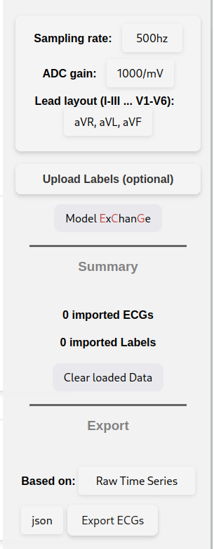
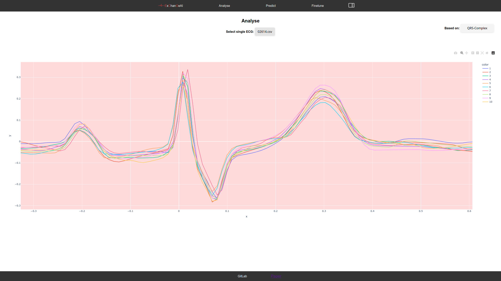
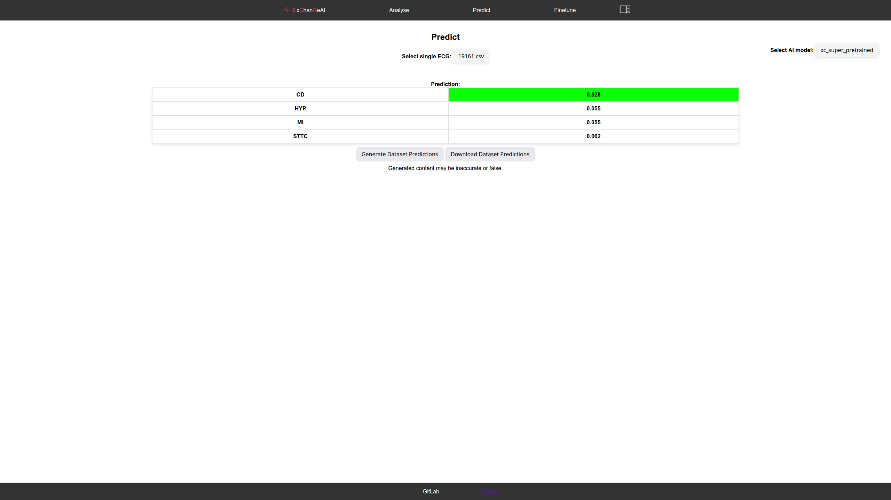
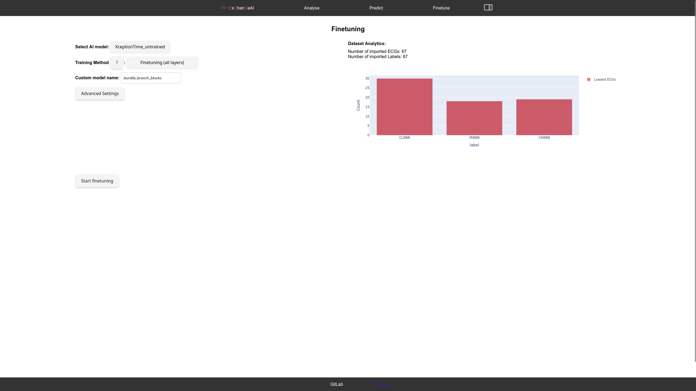
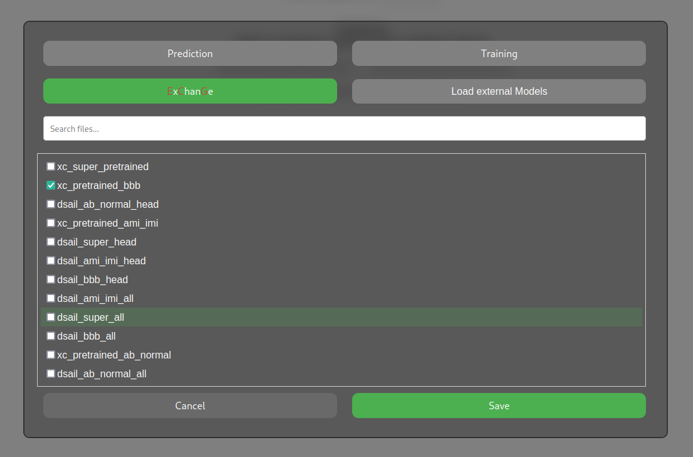

# Getting Started with ExChanGeAI

1. [Landing Page and Side-Modal](#landing-page-and-side-modal)
2. [Analyse](#analyse)
3. [Fine-tune and Prediction](#fine-tune-and-prediction)
4. [Model ExChanGe](#model-exchange)
5. [Fintuning Notes](#finetuning-notes)
6. [Key Shortcuts](#key-shortcuts)

## Landing Page and Side-Modal

The landing page is the first screen you'll see when you start the application. It provides an overview of the available features and allows you to navigate to different sections.
The side modal is a side window that appears when you click on the button on the top right. It contains options to upload data, labels, or to export, and more.

## Analyse

The raw view displays the original ECG data, allowing you to visualize and inspect the signals using the interactive viewer. The QRS view shows the detected QRS complexes, which are a crucial component of the ECG signal.

## Fine-tune and Prediction

In the prediction view, you can use pretrained AI models to predict diagnoses. Select the ECG and the pre-trained model.

The finetuning view enables you to refine and adapt the base models to your specific use case, allowing for improved performance and accuracy. This process requires ECG data and labels, which must comply with specific attributes, such as meaningful names and ICD-10 codes.

## Model ExChanGe

In the model ExChanGe, you can select which models are shown for prediction and fine-tuning. It also includes an external connection to a WebDav, which offers a larger curated selection of AI models.

## Finetuning Notes

Enables the local finetuning of base models to your specific use case.
Requires ECG data and labels. The dataset must comply with the following attributes:

- Use a meaningful names, you can also include ICD\-10 codes
- labels: `single, "," seperated .csv` file with `header (file_name, label, ICD-10)`. Example:

    |file_name|label|ICD\-10|
    |---|---|---|
    |example.csv|SR||
    |example2.csv|MI||

## Key Shortcuts

| Shortcut | Effect |
| --- | --- |
| Ctrl-S | open side Modal (data, labels, export, ...) |
| Ctrl-M | open model exchange |
| Ctrl-C | clear loaded data and labels |
| Ctrl-L | upload labels |
| Ctrl-D | upload data (only default 500hz) |

### Local Shortcuts

| Site | Shortcuts | Effect |
| --- | --- | --- |
| Analyse, Prediction | Arrows (Left, Right) | navigate loaded ECGs |

